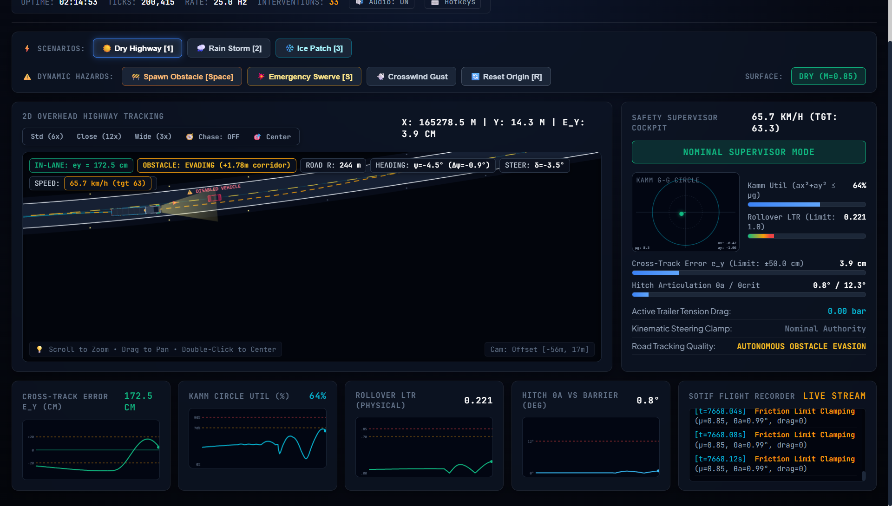
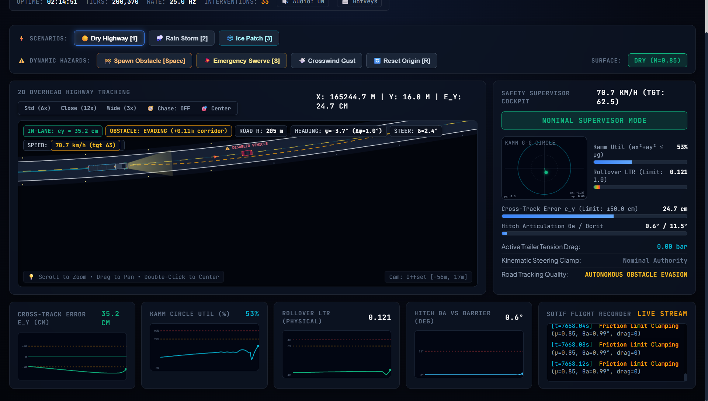
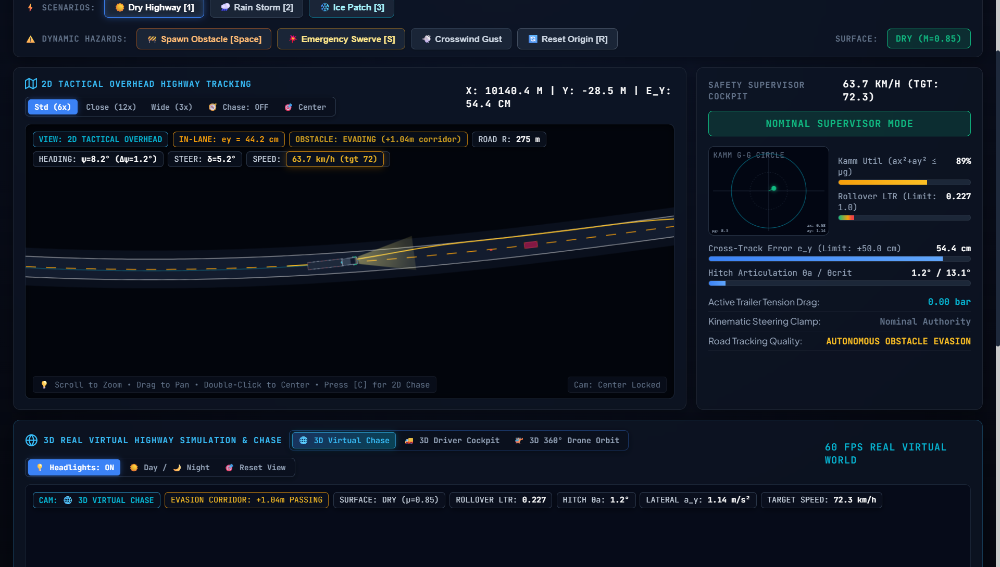
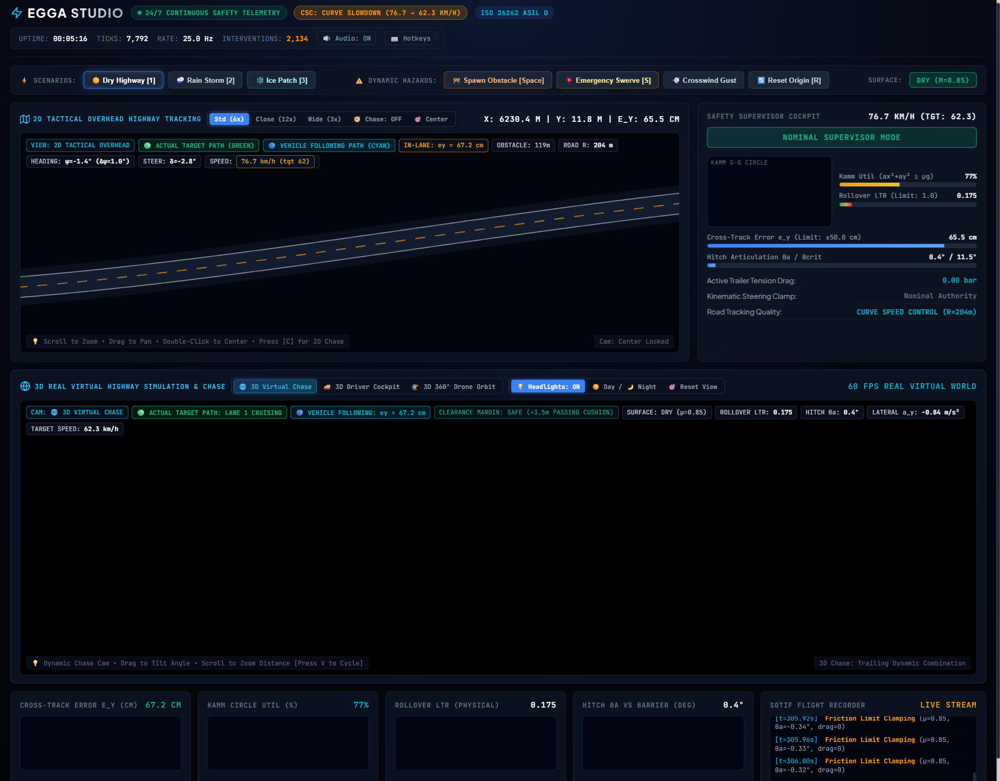
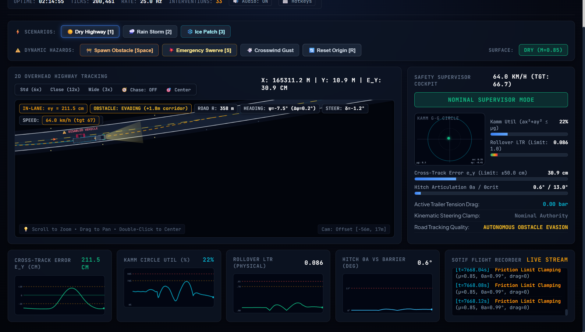

# EGGA Live Telemetry & 3D Studio

The **EGGA Studio** is a real-time, interactive 3D telemetry and supervisory monitoring suite for autonomous vehicle path tracking, dynamic stability supervision, and commercial tractor-trailer safety guards.

---

## Key Features

1. **Dual Visualization Engines**:
   - **Tactical 2D View**: Canvas-based birds-eye visualization with lane boundaries, Stanley centerline reference, vehicle footprint, velocity vector, and supervisor guard envelopes.
   - **Interactive 3D World**: Three.js rendering engine with realistic asphalt texture, lane markings, grass run-off, animated wheels, chassis roll dynamics, and dynamic environment lighting.

2. **Multi-Camera Perspective Switching**:
   - **3D Chase Cam**: Third-person tracking camera locked behind the vehicle with smooth yaw following.
   - **3D Cockpit Cam**: First-person driver/windshield perspective showing road curvature and lane tracking.
   - **3D Drone Orbit Cam**: High-altitude free-orbit drone view with mouse drag/wheel orbit controls.
   - **Split 2D / 3D Layout**: Side-by-side tactical canvas and 3D viewport for simultaneous engineering telemetry and spatial situational awareness.

3. **Audio Synthesis Engine**:
   - Web Audio API synthesizer for engine throttle hum, tire screech upon friction saturation, supervisor intervention warning chimes, and tactical hotkey feedback.

4. **Dynamic Scenario & Hazard Injection**:
   - **Obstacle Injection**: Spawn stationary or moving lane obstructions on-the-fly (`Key O` or UI button) to trigger emergency evasion maneuvers and coupled friction circle allocation.
   - **Split-$\mu$ Surface**: Dynamically alter surface friction from dry asphalt ($\mu = 1.0$) to packed snow/ice ($\mu \le 0.25$).
   - **Sensor Noise & Actuator Lag**: Inject Gaussian noise and pneumatic transport delay to test dual-rate EKF estimators and supervisor fail-safe modes (`CAUTIOUS`, `DEGRADED`, `FALLBACK`).

5. **Cross-Platform Telemetry Bridges**:
   - **Python Backend**: Fast asynchronous server (`server.py`) running 24/7 continuous simulation loops with sub-decimeter Stanley highway lane centering.
   - **MATLAB / Simulink Bridge**: Live HTTP/WebSocket bridge (`matlab/studio_matlab_bridge.m`) streaming telemetry directly from MATLAB/Simulink into the studio interface.

---

## Quick Start

### 1. Launch Studio Server (Python)
```bash
python tooling/studio/server.py --port 8088
```
Navigate to: [http://127.0.0.1:8088](http://127.0.0.1:8088)

### 2. Stream from MATLAB
In MATLAB:
```matlab
% Connect and stream proving ground RL adaptive run
studio_matlab_bridge('mission', 'proving_ground', 'controller', 'rl');

% Stream bicycle master simulation with MPC controller
studio_matlab_bridge('mission', 'bicycle_master', 'controller', 'mpc', 'trajectory', 'SineWave');
```

---

## Gallery & Visual Interface

### 3D Cockpit View


### 3D Chase View


### Split 2D Tactical & 3D Chase Mode


### Dynamic Obstacle Evasion


### Drone Orbit Perspective


---

## Keyboard Hotkeys

| Hotkey | Action |
|---|---|
| `Space` | Pause / Resume simulation |
| `1` | Switch to 2D Tactical View |
| `2` | Switch to 3D Chase View |
| `3` | Switch to 3D Cockpit View |
| `4` | Switch to 3D Drone Orbit View |
| `5` | Toggle Split 2D / 3D Layout |
| `O` | Inject Dynamic Obstacle |
| `M` | Toggle Audio Engine |
| `?` | Show Hotkey Guide Modal |
